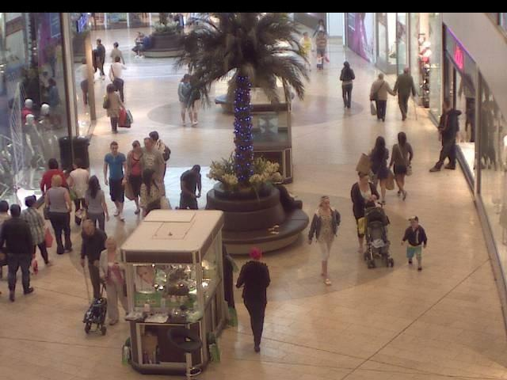
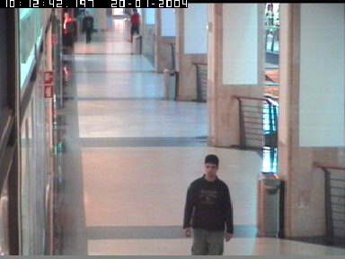

```{r setup, include=FALSE}
knitr::opts_chunk$set(echo = TRUE)
```

# Abstract

# Introduction
## Background
Surveillance cameras are used at a multitude of locations and are used for many purposes including security and activity tracking. In certain applications, human viewing of the footage may be feasible for the purpose of the system, e.g. looking back at footage for a suspected thief in a grocery store. For other applications however, human viewing is not feasible at scale, e.g. for tracking the number of people in an area 24/7. For these applications, an automated system that tracks the number of people and their locations in an image is of use.

## Problem description
In this project, I will attempt to design an algorithm that views the footage of surveillance cameras and determines 1) the number of people in the image 2) where in the view of the camera they are located. I will design this algorithm using probabilistic modeling and Markov Chain Monte Carlo (MCMC).

## Previous work
This problem is contained within computer vision, which is a broad field of computer science and applied mathematics. Within this field, classification of images are made with a variety of tools including neural networks, image segmentation algorithms, and MCMC. Specific to surveillance camera footage, there has been a multitude project made. Examples include http://wearables.cc.gatech.edu/paper_of_week/RealTimeTracking-Stauffer,Grimson.pdf tracks object modelling pixels as Gaussian mixtures, whereas https://www.cc.gatech.edu/~dellaert/pubs/Khan05pami.pdf uses particle filtering to track movements of objects, whereas http://www.cse.psu.edu/~rtc12/Papers/LiuCollinsLiuBMVC2011.pdf study the auxillary problem of camera auto calibration and http://citeseerx.ist.psu.edu/viewdoc/download;jsessionid=0FDDF7D82220DB0C7966BC8D007AA447?doi=10.1.1.53.3730&rep=rep1&type=pdf background and foreground estimation. The closest work to this project is http://www.cse.psu.edu/~rtc12/CSE586/papers/mcmcCvpr03Zhao.pdf and http://vision.cse.psu.edu/publications/pdfs/2009ge3.pdf, both performing the estimation by Reversible Jump Monte Carlo Markov Chains (RJMCMC), with different approaches to modelling.

## Data set
In order to make the scope of the project feasible, I decided to go with a surveillance footage data set that was relatively easy. Factors that make the problem of couting and locating humans in surveillance footage hard include but are not limited to:
* Views where the background, lighting and scene changes, such as outside
* Dense crowds, where people are occluding each other
* People with different postures and orientations, such as some sitting while others standing
* Areas in the background that are hard to distinguish from the foreground, e.g. glass or mirrors that reflect people in the scene
* Obscure camera angels with perspective distortion effects making modelling harder

Following are some examples of data sets of surveillance footage that I reviewed:


TODO

TODO

I decided to go with http://groups.inf.ed.ac.uk/vision/CAVIAR/CAVIARDATA1/ as a starting point since it was less complex than other datasets.

# Modelling
## Background subtraction
For my approach, first step in attempting to solve the problem is separating the foreground and background from each other, so that the foreground can be searched for humans. http://citeseerx.ist.psu.edu/viewdoc/download;jsessionid=0FDDF7D82220DB0C7966BC8D007AA447?doi=10.1.1.53.3730&rep=rep1&type=pdf suggests a Kalman filter approach for this leading to good results, while http://www.cse.psu.edu/~rtc12/CSE586/papers/mcmcCvpr03Zhao.pdf and http://vision.cse.psu.edu/publications/pdfs/2009ge3.pdf use standard techniques for background subtraction. The closest to my approach is http://wearables.cc.gatech.edu/paper_of_week/RealTimeTracking-Stauffer,Grimson.pdf which models each pixel as a gaussian mixture, and labels a pixel as foreground if it is sufficiently unlikely given this model.

First, I estimated the background image using the mean of the color values in each pixel from a portion of the data set. The intuition behind this approach is that foreground pixels get "smudged out" when averaged, since most frames have most of the background visible and objects are in different positions across frames. The mean image of 3000 randomly sampled images from the data set may be seen in fig X.

[Backgound estimating by computing the mean image](bg.jpg)

In order to classify the foreground of a given frame using this background image, I computed the difference between the mean of the color values in each pixel (effectively converting it to gray scale) of the frame and background image. If this difference was over a certain threshold, it is considered foreground, otherwise background. This leads to a foreground mask as seen in fig X.

[Example frame](bg.jpg)
[Foreground mask for the example frame, comparing it to the background image with a fixed threshold](bg.jpg)

One issue with this approach is that the variance is different among pixels, as some are more affected e.g. by natural variations such as lighting. A problem with this approach may be seen in figure (above), the floor pixels in top-middle of the image are classified as background since the lighting is different in those pixels from the frame and the mean image. This implies that a per-pixel threshold would increase performance. In order to do this, I calculate the mean square error of a random sample of frames compared to the background, effectively estimating the variance of the pixels. A multiple of the square root of the variance is then used as a threshold. This approach can effectively be viewed as modeling each pixel as a Gaussian with a certain mean and variance for being a background pixel, and classifying pixels as foreground if they are sufficiently unlikely given this description. The result of this method may be seen in fig X. There are still some artifacts from the shop window, and a person "blending" in to the background as their clothing is too similar to the background, but result is considered sufficiently good for the next step. 

[Foreground mask for the example frame, using a per-pixel threshold](bg.jpg)
[Square root of the variance map produced in order to determine the per-pixel threshold](bg.jpg)

Other approaches would be a smooth segmentation of foreground and background pixels, where e.g. edges of shapes are less defined. For this purpose, http://vision.cse.psu.edu/publications/pdfs/2009ge3.pdf models pixels as Bernoulli distributions. One way to reduce the frequency of people blending in to the background is comparing the images in color rather than in gray scale, as this would help classification in cases where the person has clothing that has the same gray scale but not color value as the background, taking advantage of more information in the classifications.

## Model description
The problem is modeled using Bayesian probabilities:

$$
P(\theta|I)=\frac{P(I|\theta)P(\theta)}{P(I)}\propto P(I|\theta)P(\theta)
$$

where $\theta$ are the parameters and $I$ the observed image. As such, $P(\theta|I)$ is the posterior distribution $\pi$, $P(I|\theta)$ the likelihood and $P(\theta)$ the prior. $P(I)$ can be viewed as normalizing constant. This constant being hard to determine motivates the use of MCMC for sampling $\pi$.

The solution to the problem is defined as the maximum a priori (MAP) estimation $\theta^*$ that maximizes $\pi$.

## Solution space
As the goal of a given frame is to determine the amount of people in the image and their location, the solution space $\Theta$ has different dimensions depending on the amount of people in the frame. The solutions space is of the form $(k,M^k)$

## Priors
X and Y uniform. Data-driven e.g. gaussian around usually but more complex sampling (<- COULD DO). Used human labels so need training sequence, could be done e.g. heat maps of foreground

W, H strong dependence with X, Y. From 3d perspective. Could use transformation, instead use data-driven. Plots of w and h of x and y, y most, the perspective of camera. h first up then down. Model as gaussian conditional on x,y, sigma eyeballed. Plots

Some papers independent, conditional instead.

k poisson, parametric fitted from data.

## Likelihood
Likelihood from paper, Z
Added term for overlap, outside (<- kan ta bort)

Using squares, paper used models or learned shape

Weigthing subjective, experience based

# Simulation
## Proposals
Data driven, k-mean segmentation given k
Initial from centers, hw from there

X and Y gaussian around (sigma), not independent case worst-case. Data-driven e.g. gaussian around usually but more complex sampling

probability for x,y or w,h

Move according to prior, x,y not in q

Process birth, death, update
Probabilities of them
## MCMC setup
Iterations, all functions and parameter values

# Result

## Accuracy
Emperical or statistical

Right if 50% covered, or labels

Common errors

Mall dataset (other parameters?)
# Discussion
## Model diagnostics / assumptions
Is poisson, process right etc
## MCMC diagnostics
Converges?
Irriducible etc, determinant of Jacobian
Trace plots examples

## Conclusion
Can be used, need tuning and computing power
## Extentions and next steps
### Particle filtering / between frames
Multiple frames
Multiple cameras, tracking
Not squares

SET SEED

```{r}
library(jpeg)
image_files <- Sys.glob("./CAVIAR/**/**.jpg")
sample_length <- 3000
sample_frames <- sample(1:length(image_files), size = sample_length, replace = F)

w <- 384
h <- 288

plot_image <- function(image, title = NULL) {
  plot(0:1,0:1,type="n",ann=!is.null(title),axes=FALSE, main=title)
  rasterImage(image,0,0,1,1)
}

to_grayscale <- function(image) {
  gray <- array(0, dim=c(h,w))
  for (x in 1:w) {
    for (y in 1:h) {
      gray[y, x] = mean(image[y, x, c(1,2,3)])
    } 
  }
  return (gray)
}

from_grayscale <- function(gray) {
  image <- array(0, dim=c(h,w,3))
  for (x in 1:w) {
    for (y in 1:h) {
      image[y, x, c(1,2,3)] = gray[y, x]
    } 
  }
  return (image)
}

background <- array(0, dim=c(h,w,3))
for (file in image_files[sample_frames]) {
  frame <- readJPEG(file, native=FALSE)
  background <- background + frame / sample_length
}

clamp <- function(x, minv, maxv) {
  return (min(max(x, minv), maxv))
}

for (i in 1:h) {
  for (j in 1:w) {
    for (c in 1:3) {
        background[i, j, c] <- clamp(background[i, j, c], 0, 1)
    }
  }
}

background_grayscale <- to_grayscale(background)

plot_image(background)
plot_image(from_grayscale(background_grayscale))

writeJPEG(background, "bg.jpg")
writeJPEG(from_grayscale(background_grayscale), "bg_gray.jpg")
```

```{r}
sample_length <- 100
sample_frames <- sample(1:length(image_files), size = sample_length, replace = F)

background_var <- array(0, dim=c(h,w))
for (file in image_files[sample_frames]) {
  frame <- readJPEG(file, native=FALSE)
  for (i in 1:h) {
    for (j in 1:w) {
      background_var[i, j] <- background_var[i, j] + (mean(frame[i, j, c(1,2,3)]) - background_grayscale[i, j])^2 / sample_length^2
    }
  }
}

background_sd <- sqrt(background_var)

hist(2 * background_sd)

plot_image(background)
plot_image(from_grayscale(background_sd * 10))
```

```{r}
library(xml2)
folders <- Sys.glob("./CAVIAR/*")
xml_files <- Sys.glob("./CAVIAR/**/**.xml")

ks <- c()
obs <- data.frame()

for (f in xml_files) {
  # f <- xml_files[1]
  doc <- read_xml(f)
  # obj_list <- xml_find_all(doc, "frame//objectlist")[1]
  for (obj_list in xml_find_all(doc, "frame//objectlist")) {
    boxes <- xml_find_all(obj_list, "object/box")
    ks <- c(ks, length(boxes))
    # obj_attrs <- xml_attrs(boxes)[[1]]
    for (obj_attrs in xml_attrs(boxes)) {
      # obs <- rbind(obs, x=as.numeric(obj_attrs$x))
      obs <- rbind(obs, list(
        x=as.numeric(obj_attrs["xc"]),
        y=as.numeric(obj_attrs["yc"]),
        w=as.numeric(obj_attrs["w"]),
        h=as.numeric(obj_attrs["h"])))
    }
  }
}

# library(ggplot2)
library(GGally)
hist(ks)

ggpairs(obs)

plot_image(background)
points(obs$x/w, 1-obs$y/h)
```

```{r}
summary(lm(w ~ y, data = obs))

h_cutoff <- 210
summary(lm(obs$h[which(obs$y <= h_cutoff)] ~ obs$y[which(obs$y <= h_cutoff)], data = obs))
summary(lm(obs$h[which(obs$y > h_cutoff)] ~ obs$y[which(obs$y > h_cutoff)], data = obs))

w_model <- function(y) {
  11.6 + 0.14*y
}
h_model <- function(y) {
  ifelse(y <= h_cutoff, 22.8 + 0.5 * y, 527.8 - 1.86 * y)
}
w_sd <- 7
h_sd <- 12

min_w <- 5
min_h <- 5
```

```{r}
# current_frame_nr <- 2000 # många personer spridda
# current_frame_nr <- 3000 # många personer klumpade
# current_frame_nr <- 5000 # 4 personer spridda
# current_frame_nr <- 4000 # många personer långt borta klumpade
# current_frame_nr <- 200 # många personer spridda
# current_frame_nr <- 2500 # en nära, nåra borta
# current_frame_nr <- 800 # en nära, nåra borta
# current_frame_nr <- 4500 # tre personer, två ihop, en ensam nära
current_frame_nr <- 20; current_k <- 4 # två nära ihop, två borta ihop
# current_frame_nr <- 3100 # många ihop
# current_frame_nr <- 5600 # tre nära
# current_frame_nr <- 5950 # två nära en vid väggen
# current_frame_nr <- 5750; current_k <- 4#; current_k <- 5 # fem utspridda
# current_frame_nr <- 5964-47+2; current_k <- 3 # två spridda, en vid väggen
current_frame <- readJPEG(image_files[current_frame_nr], native=FALSE)


plot_image(current_frame)
```

```{r}
plot_image(current_frame)

xs <- runif(50)
ys <- runif(50)

ws <- rnorm(50, mean = w_model(ys*h), sd = w_sd)/h
hs <- rnorm(50, mean = h_model(ys*h), sd = h_sd)/h

rect(xs - ws/2, 1-(ys - hs/2), xs + ws/2, 1-(ys + ys/2), col=rgb(1,0,0,0.1))

plot(obs$y, obs$w)
points(ys*h, ws*h, col="red")

plot(obs$y, obs$h)
points(ys*h, hs*h, col="red")
```

```{r}
threshold <- 0.2
sd_multiplier <- 20
# threshold <- 0
# sd_multiplier <- 0


background <- readJPEG("./bg.jpg", native=FALSE)

background_subtraction <- function(img, background) {
  mask <- array(dim=c(h,w))
  for (x in 1:w) {
    for (y in 1:h) {
      # mask[y, x] <- ifelse(abs(mean(img[y, x, c(1,2,3)])-mean(background[y, x, c(1,2,3)])) < threshold, 0, 1)
      # mask[y, x] <- ifelse(abs(mean(img[y, x, c(1,2,3)]-background[y, x, c(1,2,3)])) < threshold, 0, 1)
      mask[y, x] <- ifelse(abs(mean(img[y, x, c(1,2,3)]) - mean(background[y, x, c(1,2,3)])) < max(sd_multiplier*background_sd[y, x], threshold), 0, 1)
      # mask[y, x] <- ifelse(abs(mean(img[y, x, c(1,2,3)]) - mean(background[y, x, c(1,2,3)])) < max(sd_multiplier^2*background_var[y, x], threshold), 0, 1)
    }
  }
  return (mask)
}

foreground <- background_subtraction(current_frame, background)

plot_image(from_grayscale(foreground))
plot_image(current_frame)
plot_image(background)
```


```{r}
points <- data.frame()

for (x in 1:w) {
  for (y in 1:h) {
    if (foreground[y, x] == 1) {
      points <- rbind(points, list(x=x,y=y))
    }
  }
}

plot(points$x, h-points$y)

clusters <- kmeans(points, current_k)

points(clusters$centers[,1], h-clusters$centers[,2], col="green")

for (k in 1:current_k) {
  xc <- clusters$centers[k, 1]
  yc <- clusters$centers[k, 2]
  
  ws <- rnorm(50, mean = w_model(yc), sd = w_sd)
  hs <- rnorm(50, mean = h_model(yc), sd = h_sd)
  
  rect(
    xc-ws/2,
    h-(yc-hs/2),
    xc+ws/2,
    h-(yc+hs/2),
    col = rgb(1,0,1,0.01)
  )
}
```

```{r}
points <- list()

for (k in 1:current_k) {
  xc <- clusters$centers[k, 1]
  yc <- clusters$centers[k, 2]
  
  ww <- rnorm(1, mean = w_model(yc), sd = w_sd)
  hh <- rnorm(1, mean = h_model(yc), sd = h_sd)
  
  points[[k]] <- list(x=xc,y=yc,w=ww,h=hh)
}

initial_state <- list(
  k = current_k,
  points = points
)

render_state <- function(state, title=NULL) {
  plot_image(from_grayscale(foreground), title)

  cols <- c(
    rgb(1,0,0,0.5),
    rgb(0,1,0,0.5),
    rgb(0,0,1,0.5),
    rgb(1,0,1,0.5),
    rgb(1,1,0,0.5)
  )
  
  i <- 1
  for (point in state$points) {
    col <- cols[i %% length(cols) + 1]
    i <- i + 1
    rect((point$x - point$w/2) / w, 1-(point$y - point$h/2) / h, (point$x + point$w/2)/w, 1-(point$y + point$h/2)/h, col = col)
  }
}

render_state(initial_state)

points_unif <- list()

for (k in 1:current_k) {
  xc <- runif(1, 0, w)
  yc <- runif(1, 0, h)

  ww <- rnorm(1, mean = w_model(yc), sd = w_sd)
  hh <- rnorm(1, mean = h_model(yc), sd = h_sd)

  points_unif[[k]] <- list(x=xc,y=yc,w=ww,h=hh)
}

initial_state_unif <- list(
  k = current_k,
  points = points_unif
)

render_state(initial_state_unif)
```


```{r}
metropolis_hastings <- function(q_sample, q_ratio, pi_ratio, N, initial_state) {
  state <- initial_state
  
  states <- list(state)
  
  for (i in 1:N) {
    proposed <- q_sample(state)
    
    alpha <- q_ratio(state, proposed) * pi_ratio(proposed, state)
    if (alpha >= 1 || runif(1) <= alpha) {
      state <- proposed
    }
      
    states <- append(states, list(state))
  }
  
  return (states)
}
```

```{r}
likelihood <- function(state) {
  state_mask <- array(0, dim=c(h, w))

  outside <- 0
  overlap <- 0
  for (i in 1:state$k) {
    point <- state$points[[i]]
    for (x in round(point$x - point$w/2):round(point$x + point$w/2)) {
      for (y in round(point$y - point$h/2):round(point$y + point$h/2)) {
        if (y >= 1 && y <= h && x >= 1 && x <= w) {
          if (state_mask[y, x] == 0) {
            state_mask[y, x] = 1
          } else {
            overlap <- overlap + 1
          }
        } else {
          outside <- outside + 1
        }
      }
    }
  }
  N10 <- sum(state_mask == 1 & foreground == 0)
  N01 <- sum(state_mask == 0 & foreground == 1)
  
  measures <- c(N10, N01, outside, overlap)
  
  # weights <- c(0.0001, 0.0001, 0.0001, 0.00005)
  weights <- c(0.0005, 0.01, 0.0001, 0.00001)*10
  
  Z <- measures %*% weights
  
  # print(c(measures, exp(-Z), prior(state)))
  
  return (exp(-Z) * prior(state))
}

pi_ratio <- function(state_1, state_2) {
  likelihood(state_1) /  likelihood(state_2)
}

x_sd <- w*.03
y_sd <- h*.03
propose <- function(state) {
  i <- sample(1:state$k, 1)
  p <- state$points[[i]]
  
  # if (runif(1) < 0.8) {
    state$points[[i]]$x <- clamp(rnorm(1, mean = p$x, sd=x_sd), p$w/2, w-p$w/2)
    state$points[[i]]$y <- clamp(rnorm(1, mean = p$y, sd=y_sd), p$h/2, h-p$h/2)
  # } else {
    p <- state$points[[i]]
    state$points[[i]]$w <- clamp(rnorm(1, mean = w_model(p$y), sd = w_sd), min_w, w)
    state$points[[i]]$h <- clamp(rnorm(1, mean = h_model(p$y), sd = h_sd), min_h, h)
  # }
  
  return (state)
}

prior <- function(x) {
  prob <- 1
  for (p in x$points) {
    prob <- prob * dnorm(p$w, mean = w_model(p$y), sd = w_sd) * dnorm(p$h, mean = h_model(p$y), sd = h_sd)
  }
  prob
}

proposal_prob <- function(x) {
  prior(x)
  # prob <- 1
  # # for (p in x$points) {
  # #   prob <- prob * dmvnorm(c(p$x, p$y), mean, sigma) * dmvnorm(c(p$w, p$h), mean_size, sigma_size)
  # # }
  # for (p in x$points) {
  #   prob <- prob * dmvnorm(c(p$w, p$h), mean_size, sigma_size)
  # }
  # prob
  1
}

proposal_prob_ratio <- function(x, y) {
  proposal_prob(x) / proposal_prob(y)
}

states <- metropolis_hastings(
  propose,
  proposal_prob_ratio,
  pi_ratio,
  1000,
  initial_state
)


ls <- c()
ps <- c()
for (s in states) {
  ls <- c(ls, likelihood(s))
  ps <- c(ps, prior(s))
}
plot(ls, col="black", type="l", ylim=c(0,quantile(c(ls, ps), 0.8)))
# plot(ls, col="black", type="l")
lines(ps, col="red")

render_states <- function(states, indices, title) {
  for (s in states[indices]) {
    render_state(s, title)
  }
}

render_states(states, seq(1,4), "first")
render_states(states, length(states)-seq(1,5)-1, "last")
render_states(states, order(ls, decreasing = 1)[c(seq(1,20))], "best")
render_states(states, order(ls, decreasing = 1)[c(length(states)-seq(1,5)-1)], "worst")
render_states(states, sample(1:length(states), 5), "random")
```


```{r}

# s_good <- states[[1]]
# s_bad <- states[[order(ls, decreasing = 1)[1]]]
s_good <- states[[order(ls, decreasing = 1)[2]]]
s_bad <- states[[order(ls, decreasing = 1)[1]]]
render_state(s_good)
render_state(s_bad)
likelihood(s_good)
likelihood(s_bad)
```


```{r}
locs <- data.frame()
for (s in states) {
  locs <- rbind(locs, s$points[[1]])
}

locs

ggpairs(locs)

plot(locs$x, col="red")
lines(rep(states[[order(ls, decreasing = 1)[1]]]$points[[2]]$x, length(locs$x)))
plot(locs$y, col="green")
plot(locs$w, col="blue")
plot(locs$h, col="purple")
```


