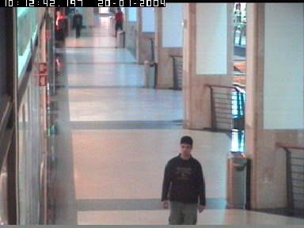

```{r setup, include=FALSE}
knitr::opts_chunk$set(echo = TRUE)
```
CONVERGENCE
DOWNSAMPLE
NEED LONger to converge when k high
Likelihood increases over time
# Abstract

# Introduction
## Background
Surveillance cameras are used at a multitude of locations and are used for many purposes including security and activity tracking. In certain applications, human viewing of the footage may be feasible for the purpose of the system, e.g. looking back at footage for a suspected thief in a grocery store. For other applications however, human viewing is not feasible at scale, e.g. for tracking the number of people in an area 24/7. For these applications, an automated system that tracks the number of people and their locations in an image is of need.

## Problem description
In this project, I will attempt to design an algorithm that views the footage of surveillance cameras and determines 1) the number of people in the image 2) where in the view of the camera they are located. I will design this algorithm using probabilistic modeling and Markov Chain Monte Carlo (MCMC).

## Previous work
This problem is contained within computer vision, which is a broad field of computer science and applied mathematics. Within this field, classification of images are made with a variety of tools including neural networks, image segmentation algorithms, and MCMC. Specific to surveillance camera footage, there has been a breadth project made. Examples include http://wearables.cc.gatech.edu/paper_of_week/RealTimeTracking-Stauffer,Grimson.pdf tracks object modelling pixels as Gaussian mixtures, whereas https://www.cc.gatech.edu/~dellaert/pubs/Khan05pami.pdf uses particle filtering to track movements of objects, whereas http://www.cse.psu.edu/~rtc12/Papers/LiuCollinsLiuBMVC2011.pdf study the auxillary problem of camera auto calibration and http://citeseerx.ist.psu.edu/viewdoc/download;jsessionid=0FDDF7D82220DB0C7966BC8D007AA447?doi=10.1.1.53.3730&rep=rep1&type=pdf background and foreground estimation. The closest work to this project is http://www.cse.psu.edu/~rtc12/CSE586/papers/mcmcCvpr03Zhao.pdf and http://vision.cse.psu.edu/publications/pdfs/2009ge3.pdf, both performing the estimation by Reversible Jump Monte Carlo Markov Chains (RJMCMC), with different approaches to modelling.

## Data set
In order to make the scope of the project feasible, I decided to go with a surveillance footage data set that was relatively easy. Factors that make the problem of couting and locating humans in surveillance footage hard include but are not limited to:
* Views where the background, lighting and scene changes, such as outside
* Dense crowds, where people are occluding each other
* People with different postures and orientations, such as some sitting while others standing
* Areas in the background that are hard to distinguish from the foreground, e.g. glass or mirrors that reflect people in the scene
* Obscure camera angels with perspective distortion effects making modelling harder

Following are some examples of data sets of surveillance footage that I reviewed:


TODO

TODO

I decided to go with http://groups.inf.ed.ac.uk/vision/CAVIAR/CAVIARDATA1/ as a starting point since it was less complex than other datasets.

The dataset includes video image frames from various sequences with varying amounts of people and activities. I have selected a subset of these sequences that were deemed appropriate for the project. In addition, each frame in the dataset is labelled with human labeled bounding boxes of the people in the scene specifying the amount of people and their position, width and height.

# Modelling
## Background subtraction
For my approach, first step in attempting to solve the problem is separating the foreground and background from each other, so that the foreground can be searched for humans. http://citeseerx.ist.psu.edu/viewdoc/download;jsessionid=0FDDF7D82220DB0C7966BC8D007AA447?doi=10.1.1.53.3730&rep=rep1&type=pdf suggests a Kalman filter approach for this leading to good results, while http://www.cse.psu.edu/~rtc12/CSE586/papers/mcmcCvpr03Zhao.pdf and http://vision.cse.psu.edu/publications/pdfs/2009ge3.pdf use standard techniques for background subtraction. The closest to my approach is http://wearables.cc.gatech.edu/paper_of_week/RealTimeTracking-Stauffer,Grimson.pdf which models each pixel as a gaussian mixture, and labels a pixel as foreground if it is sufficiently unlikely given this model.

First, I estimated the background image using the mean of the color values in each pixel from a portion of the data set. The intuition behind this approach is that foreground pixels get "smudged out" when averaged, since most frames have most of the background visible and objects are in different positions across frames. The mean image of 3000 randomly sampled images from the data set may be seen in fig X.

[Backgound estimating by computing the mean image](bg.jpg)

In order to classify the foreground of a given frame using this background image, I computed the difference between the mean of the color values in each pixel (effectively converting it to gray scale) of the frame and background image. If this difference was over a certain threshold, it is considered foreground, otherwise background. This leads to a foreground mask as seen in fig X.

[Example frame](bg.jpg)
[Foreground mask for the example frame, comparing it to the background image with a fixed threshold](bg.jpg)

One issue with this approach is that the variance is different among pixels, as some are more affected e.g. by natural variations such as lighting. A problem with this approach may be seen in figure (above), the floor pixels in top-middle of the image are classified as background since the lighting is different in those pixels from the frame and the mean image. This implies that a per-pixel threshold would increase performance. In order to do this, I calculate the mean square error of a random sample of frames compared to the background, effectively estimating the variance of the pixels. A multiple of the square root of the variance is then used as a threshold. This approach can effectively be viewed as modeling each pixel as a Gaussian with a certain mean and variance for being a background pixel, and classifying pixels as foreground if they are sufficiently unlikely given this description. The result of this method may be seen in fig X. There are still some artifacts from the shop window, and a person "blending" in to the background as their clothing is too similar to the background, but result is considered sufficiently good for the next step. 

[Foreground mask for the example frame, using a per-pixel threshold](bg.jpg)
[Square root of the variance map produced in order to determine the per-pixel threshold](bg.jpg)

Other approaches would be a smooth segmentation of foreground and background pixels, where e.g. edges of shapes are less defined. For this purpose, http://vision.cse.psu.edu/publications/pdfs/2009ge3.pdf models pixels as Bernoulli distributions. One way to reduce the frequency of people blending in to the background is comparing the images in color rather than in gray scale, as this would help classification in cases where the person has clothing that has the same gray scale but not color value as the background, taking advantage of more information in the classifications.

## Model description
The problem is modeled using Bayesian probabilities:

$$
P(\theta|I)=\frac{P(I|\theta)P(\theta)}{P(I)}\propto P(I|\theta)P(\theta)
$$

where $\theta$ are the parameters and $I$ the observed image. As such, $P(\theta|I)$ is the posterior distribution $\pi$, $P(I|\theta)$ the likelihood and $P(\theta)$ the prior. $P(I)$ can be viewed as normalizing constant. This constant being hard to determine motivates the use of MCMC for sampling $\pi$.

The solution to the problem is defined as the maximum a priori (MAP) estimation $\theta^*$ that maximizes $\pi$.

## Solution space
As the goal of a given frame is to determine the amount of people in the image and their location, the solution space $\Theta$ has different dimensions depending on the amount of people in the frame. The solutions space is of the form $\theta \in \{k,\{M_1,M_2,\dots,M_k\}\}$, where $k$ is the number of objects in the image, and each $M_i$ represent the position, width and height of the object. As such $M_i\in\mathbb{R}^4$.

## Priors
### k
For $k$, a Poisson distribution is assumed, which is consitent with http://vision.cse.psu.edu/publications/pdfs/2009ge3.pdf which labels the process as a homogenous Poisson point process. To estimate the parameter for the Poisson distribution, the labelled information is used, where the parameter is calculated as the MLE estimate given the data. As this method required labelling of training footage for the system to be used, which may be laborous for a commercial system, in practise other simpler methods could be used such as counting the amount of people in the scene at random intervals. http://vision.cse.psu.edu/publications/pdfs/2009ge3.pdf opted for not using a prior on $k$ for robustness.

### Position
As some parts of the scene are occupied more often than other, the extreme example being the pixels of the walls which are never occupied, a prior on the position could be applied. This could be included in the model either by e.g. using a single or multi-modal Gaussian prior for the position. In this project, I decided on simply using a uniform prior within the image space, in order to simplify the model and sampling. This is a  homogeneous Poisson point process

Below is a heat-map of the positions from the data labels. 

TODO [Foreground mask for the example frame, using a per-pixel threshold](bg.jpg)


### Size
Since the space of the scene is projected on a 2d camera plane, the sizes of people in the scene vary with their position, as object far away generally are smaller than objects close to the camera. This can calibrated and modelled in a multitude of ways. http://vision.cse.psu.edu/publications/pdfs/2009ge3.pdf uses a method for getting an estimate of the vertical vanishing point of the image and determines the perspective transform from there, proposed by http://vision.cse.psu.edu/publications/pdfs/2009ge3.pdf. http://vision.cse.psu.edu/publications/pdfs/2009ge3.pdf opts for a simple model that penalizes big sizes to avoid unnecessary overlapping, as well as small sizes for blobs that are likely due to image noise.

In this project I opted for a different approach, using the labeled data. Because of the perspective of the chosen scene and camera, size mostly varies in the $y$ direction. Below is a plot of the observed width and height as a function of $y$ position in black. It is clear that they both generally decrease linearly with $y$. An interesting thing to note is that the height increases to a certain point as an object comes closer, after which it decreases. This is because a bounding box covering the object but keeping within the bounds of the image gets smaller as the persons nears the edge. EXAMPLE. In addition, not all points fit this pattern, where some outliers exist. In order to model this, both width and height were modelled as Gaussians centered around the observed trend as a function of $y$. Formally:

$$
w_i\sim N(f_w(y_i),\sigma_w^2)\\
h_i\sim N(f_h(y_i),\sigma_h^2)\\
$$

The functions $f_w$ and $f_h$ were estimated using linear regression, where $f_h$ were regressed on the part before and after the turning point. The variances $\sigma_w^2$ and $\sigma_h^2$ were determined manually such that the observed data was reasonably covered within one standard deviation. In the figure, the red dots correspond to the modelled $w$ and $h$. Again, as this approach required labeled data, the http://vision.cse.psu.edu/publications/pdfs/2009ge3.pdf is probably better suited for easier setup of camera systems. Overlapping were handled in a different way, see Likelihood section. In additon, the width and height are clamped, in order to prevent e.g. negative values or other extreme cases.

PARAMETER VALUES

### Prior

In this model, I assume the points and $k$ are independent, whereas the width and height are conditionally dependent on the position. The $X_i$ and $Y_i$ are assumed to be independent of each other and $W_i|Y$ and $H_i|Y$ are conditionally independent. This is different from e.g. http://vision.cse.psu.edu/publications/pdfs/2009ge3.pdf where all the parameters are are modelled as independent of each other.


Putting it all together, we have for a given point $k\sim\theta$:

$$
\begin{aligned}
P(\theta)&=P(k, \{X_i=x_i,Y_i=y_i,W_i=w_i,H_i=h_i\forall i\in 1\dots k\})\\
&=P(K=k)\prod_{i=1}^P(X_i=x_i,Y_i=y_i,W_i=w_i,H_i=h_i)\\ 
&=P(K=k)\prod_{i=1}^kP(X_i=x_i)P(Y_i=y_i)(W_i=w_i|Y_i=y_i)P(H_i=h_i|Y_i=y_i)\\
&\propto \frac{\lambda_K^ke^{-\lambda_K}}{k!} \prod_{i=1}^k\varphi(\frac{w_i-f_w(y_i)}{\sigma_w})\varphi(\frac{h_i-f_h(y_i)}{\sigma_h})
\end{aligned}
$$

Where $\varphi$ is the standard Gaussian pdf.

## Object shape model
Given a $k$ and a foreground mask, the problem can be viewed as choosing positions and sizes such that the foreground mask is covered as much as possible, with as little overlap as possible, and as few non foreground pixels covered as possible. The shape of humans can be modelled in a multitude of ways: http://vision.cse.psu.edu/publications/pdfs/2009ge3.pdf uses a pre construced 3D model of humans in different orientations consisting of ellipses for the body, head and limbs, while http://vision.cse.psu.edu/publications/pdfs/2009ge3.pdf estimated a "smooth" model of human shapes. In this project, in order to limit the scope, I have decided to use rectangles as a shape model.

## Likelihood
Modelling each pixel as a Bernoulli variable with a probability of being foreground or background given that there is a human there or not, as well as assuming independence between pixels, http://vision.cse.psu.edu/publications/pdfs/2009ge3.pdf comes up with a likelihood of the form:

$$
P(I|\theta)=\alpha e^{-(\lambda_{10}N_{10}+\lambda_{01}N_{01})}\propto e^{-Z_1}
$$
where $N_{10}$ are the number of pixels where the foreground mask is active but the given solution is not, while $N_{01}$ are the number of pixels where the foreground mask is not active but the given solution is, and $\lambda_{10}$ and $\lambda_{01}$ are parameters, that can be interpreted as weights. Extending on this model, this project adds a term $\lambda_2O$ to $Z_1$, where $O$ are the amount of pixels that are overlapped by several rectangles and $\lambda_2$ a weight. As such, we have likelihood function:

$$
P(I|\theta)\propto e^{-Z}
$$

where $Z=\lambda_{10}N_{10}+\lambda_{01}N_{01}+\lambda_2O$. The parameters were estimated by testing examples and balancing the terms until good enough performance were achieved.

## Posterior
Putting it all together, we have the posterior distribution:

$$
\begin{aligned}
P(\theta|I)&\propto P(I|\theta)P(\theta)\\
&\propto e^{-\lambda_{10}N_{10}+\lambda_{01}N_{01}+\lambda_2O}\frac{\lambda_K^ke^{-\lambda_K}}{k!} \prod_{i=1}^k\varphi(\frac{w_i-f_w(y_i)}{\sigma_w})\varphi(\frac{h_i-f_h(y_i)}{\sigma_h})
\end{aligned}
$$

As this distribution is complex and does not have a closed form, however it is a mix of known distributions determined up to a constant, we use Monte Carlo methods to sample from it and find its modes and MAP-estimation.

# Simulation
In order to sample from the distribution an MCMC is constructed. In order for the chain to converge to the posterior distribution $\pi(X)$, the Metropolis-Hasting conditions are implemented, with proposals $q(X,X')$. In addition, as the dimensions of the space change with $k$, Reversible Jump MCMC (RJMCMC) are used.

Formally, the algorithm works from a given state $X$, and proposes a new state $X'$ according to a proposal distribution $q(X,X')$. Since the space expands and contracts with $k$, this is a special case of expansion-contraction, where $k$ increasing by 1 is expansion and decreasing is contraction file:///C:/Users/johnr/Desktop/MC/2020_Book_MonteCarloMethods.pdf. The expansion adds a new point $u$, whereas contraction removes it. We then have accept the proposal with probability $\alpha$, where


$$
\alpha(x\to x') = \min\Big(1, \frac{\pi(X')}{\pi(X)q(U|X)}\Big)
$$
for expansion, and for contraction:

$$
\alpha(x'\to x) = \min\Big(1, \frac{\pi(X)q(U|X)}{\pi(X')}\Big)
$$


## Proposals
Data driven, k-mean segmentation given k
Initial from centers, hw from there

X and Y gaussian around (sigma), not independent case worst-case. Data-driven e.g. gaussian around usually but more complex sampling

probability for x,y or w,h

Move according to prior, x,y not in q

Process birth, death, update
Probabilities of them
## MCMC setup
Iterations, all functions and parameter values

# Result

## Accuracy
Emperical or statistical

Right if 50% covered, or labels

Common errors

Mall dataset (other parameters?)
# Discussion
## Model diagnostics / assumptions
Is poisson, process right etc
## MCMC diagnostics
Converges?
Irriducible etc, determinant of Jacobian
Trace plots examples

## Conclusion
Can be used, need tuning and computing power
## Extentions and next steps
BETTER BACKGROUND SUBTRACTION
BETTER DIFFUSION, BROWNING MOTION, Langevin equations
Find modes with temeprature
Better optimized likelihood functions, local
BETTER HUMAN MODEL
MORE ROBUST CALIBRATION
### Particle filtering / between frames
Multiple frames
Multiple cameras, tracking
Not squares

SET SEED

```{r}
library(jpeg)
image_files <- Sys.glob("./CAVIAR/**/**.jpg")
sample_length <- 3000
sample_frames <- sample(1:length(image_files), size = sample_length, replace = F)

w <- 384
h <- 288

plot_image <- function(image, title = NULL) {
  plot(0:1,0:1,type="n",ann=!is.null(title),axes=FALSE, main=title)
  rasterImage(image,0,0,1,1)
}

to_grayscale <- function(image) {
  gray <- array(0, dim=c(h,w))
  for (x in 1:w) {
    for (y in 1:h) {
      gray[y, x] = mean(image[y, x, c(1,2,3)])
    } 
  }
  return (gray)
}

from_grayscale <- function(gray) {
  image <- array(0, dim=c(h,w,3))
  for (x in 1:w) {
    for (y in 1:h) {
      image[y, x, c(1,2,3)] = gray[y, x]
    } 
  }
  return (image)
}

background <- array(0, dim=c(h,w,3))
for (file in image_files[sample_frames]) {
  frame <- readJPEG(file, native=FALSE)
  background <- background + frame / sample_length
}

clamp <- function(x, minv, maxv) {
  return (min(max(x, minv), maxv))
}

for (i in 1:h) {
  for (j in 1:w) {
    for (c in 1:3) {
        background[i, j, c] <- clamp(background[i, j, c], 0, 1)
    }
  }
}

background_grayscale <- to_grayscale(background)

plot_image(background)
plot_image(from_grayscale(background_grayscale))

writeJPEG(background, "bg.jpg")
writeJPEG(from_grayscale(background_grayscale), "bg_gray.jpg")
```

```{r}
sample_length <- 100
sample_frames <- sample(1:length(image_files), size = sample_length, replace = F)

background_var <- array(0, dim=c(h,w))
for (file in image_files[sample_frames]) {
  frame <- readJPEG(file, native=FALSE)
  for (i in 1:h) {
    for (j in 1:w) {
      background_var[i, j] <- background_var[i, j] + (mean(frame[i, j, c(1,2,3)]) - background_grayscale[i, j])^2 / sample_length^2
    }
  }
}

background_sd <- sqrt(background_var)

hist(2 * background_sd)

plot_image(background)
plot_image(from_grayscale(background_sd * 10))
```

```{r}
library(xml2)
folders <- Sys.glob("./CAVIAR/*")
xml_files <- Sys.glob("./CAVIAR/**/**.xml")

ks <- c()
obs <- data.frame()

for (f in xml_files) {
  # f <- xml_files[1]
  doc <- read_xml(f)
  # obj_list <- xml_find_all(doc, "frame//objectlist")[1]
  for (obj_list in xml_find_all(doc, "frame//objectlist")) {
    boxes <- xml_find_all(obj_list, "object/box")
    ks <- c(ks, length(boxes))
    # obj_attrs <- xml_attrs(boxes)[[1]]
    for (obj_attrs in xml_attrs(boxes)) {
      # obs <- rbind(obs, x=as.numeric(obj_attrs$x))
      obs <- rbind(obs, list(
        x=as.numeric(obj_attrs["xc"]),
        y=as.numeric(obj_attrs["yc"]),
        w=as.numeric(obj_attrs["w"]),
        h=as.numeric(obj_attrs["h"])))
    }
  }
}

# library(ggplot2)
library(GGally)
hist(ks)

ggpairs(obs)

plot_image(background)
points(obs$x/w, 1-obs$y/h)
```

```{r}
summary(lm(w ~ y, data = obs))

h_cutoff <- 210
summary(lm(obs$h[which(obs$y <= h_cutoff)] ~ obs$y[which(obs$y <= h_cutoff)], data = obs))
summary(lm(obs$h[which(obs$y > h_cutoff)] ~ obs$y[which(obs$y > h_cutoff)], data = obs))

w_model <- function(y) {
  11.6 + 0.14*y
}
h_model <- function(y) {
  ifelse(y <= h_cutoff, 22.8 + 0.5 * y, 527.8 - 1.86 * y)
}
w_sd <- 7
h_sd <- 12

min_w <- 5
min_h <- 5
```

```{r}
library(jpeg)
# current_frame_nr <- 2000; current_k <- 6 # många personer spridda
# current_frame_nr <- 3000; current_k <- 8 # många personer klumpade
# current_frame_nr <- 5000 # 4 personer spridda
# current_frame_nr <- 4000 # många personer långt borta klumpade
current_frame_nr <- 200 # många personer spridda
# current_frame_nr <- 2500 # en nära, nåra borta
# current_frame_nr <- 800 # en nära, nåra borta
# current_frame_nr <- 4500 # tre personer, två ihop, en ensam nära
# current_frame_nr <- 20; current_k <- 4 # två nära ihop, två borta ihop
# current_frame_nr <- 3100 # många ihop
# current_frame_nr <- 5600 # tre nära
# current_frame_nr <- 5950 # två nära en vid väggen
# current_frame_nr <- 5750; current_k <- 4#; current_k <- 5 # fem utspridda
# current_frame_nr <- 5964-47+2; current_k <- 3 # två spridda, en vid väggen
current_frame <- readJPEG(image_files[current_frame_nr], native=FALSE)


plot_image(current_frame)
```

```{r}
plot_image(current_frame)

xs <- runif(50)
ys <- runif(50)

ws <- rnorm(50, mean = w_model(ys*h), sd = w_sd)/h
hs <- rnorm(50, mean = h_model(ys*h), sd = h_sd)/h

rect(xs - ws/2, 1-(ys - hs/2), xs + ws/2, 1-(ys + ys/2), col=rgb(1,0,0,0.1))

plot(obs$y, obs$w)
points(ys*h, ws*h, col="red")

plot(obs$y, obs$h)
points(ys*h, hs*h, col="red")
```

```{r}
threshold <- 0.2
# sd_multiplier <- 10

# sd_multiplier <- 20
sd_multiplier <- 800

background <- readJPEG("./bg.jpg", native=FALSE)

background_subtraction <- function(img, background) {
  mask <- array(dim=c(h,w))
  for (x in 1:w) {
    for (y in 1:h) {
      # mask[y, x] <- ifelse(abs(mean(img[y, x, c(1,2,3)])-mean(background[y, x, c(1,2,3)])) < threshold, 0, 1)
      # mask[y, x] <- ifelse(abs(mean(img[y, x, c(1,2,3)]-background[y, x, c(1,2,3)])) < threshold, 0, 1)
      mask[y, x] <- ifelse(abs(mean(img[y, x, c(1,2,3)]) - mean(background[y, x, c(1,2,3)])) < max(sd_multiplier*background_var[y, x], threshold), 0, 1)
      # mask[y, x] <- ifelse(abs(mean(img[y, x, c(1,2,3)]) - mean(background[y, x, c(1,2,3)])) < max(sd_multiplier^2*background_var[y, x], threshold), 0, 1)
    }
  }
  return (mask)
}

foreground <- background_subtraction(current_frame, background)

plot_image(from_grayscale(foreground))
plot_image(current_frame)
plot_image(background)
```


```{r}
points <- data.frame()

for (x in 1:w) {
  for (y in 1:h) {
    if (foreground[y, x] == 1) {
      points <- rbind(points, list(x=x,y=y))
    }
  }
}

plot(points$x, h-points$y)

clusters <- kmeans(points, current_k)

points(clusters$centers[,1], h-clusters$centers[,2], col="green")

for (k in 1:current_k) {
  xc <- clusters$centers[k, 1]
  yc <- clusters$centers[k, 2]
  
  ws <- rnorm(50, mean = w_model(yc), sd = w_sd)
  hs <- rnorm(50, mean = h_model(yc), sd = h_sd)
  
  rect(
    xc-ws/2,
    h-(yc-hs/2),
    xc+ws/2,
    h-(yc+hs/2),
    col = rgb(1,0,1,0.01)
  )
}
```

```{r}
# points <- list()
# 
# for (k in 1:current_k) {
#   xc <- clusters$centers[k, 1]
#   yc <- clusters$centers[k, 2]
#   
#   ww <- rnorm(1, mean = w_model(yc), sd = w_sd)
#   hh <- rnorm(1, mean = h_model(yc), sd = h_sd)
#   
#   points[[k]] <- list(x=xc,y=yc,w=ww,h=hh)
# }
# 
# initial_state <- list(
#   k = current_k,
#   points = points
# )
# 
render_state <- function(state, title=NULL) {
  plot_image(from_grayscale(foreground), title)

  cols <- c(
    rgb(1,0,0,0.5),
    rgb(0,1,0,0.5),
    rgb(0,0,1,0.5),
    rgb(1,0,1,0.5),
    rgb(1,1,0,0.5)
  )

  i <- 1
  for (point in state$points) {
    col <- cols[i %% length(cols) + 1]
    i <- i + 1
    rect((point$x - point$w/2) / w, 1-(point$y - point$h/2) / h, (point$x + point$w/2)/w, 1-(point$y + point$h/2)/h, col = col)
  }
}
# 
# render_state(initial_state)

points_unif <- list()
k_unif <- sample(1:10, 1)

for (k in 1:k_unif) {
  xc <- runif(1, 0, w)
  yc <- runif(1, 0, h)

  ww <- rnorm(1, mean = w_model(yc), sd = w_sd)
  hh <- rnorm(1, mean = h_model(yc), sd = h_sd)

  points_unif[[k]] <- list(x=xc,y=yc,w=ww,h=hh)
  
  points_unif[[k]]$x <- clamp(xc, ww/2+1, w-ww/2)
  points_unif[[k]]$y <- clamp(yc, hh/2+1, h-hh/2)
}

initial_state_unif <- list(
  k = k_unif,
  points = points_unif
)

initial_state_unif$likelihood <- likelihood(initial_state_unif)

render_state(initial_state_unif)
```


```{r}
metropolis_hastings <- function(q_sample, q_ratio, pi_ratio, N, initial_state) {
  state <- initial_state
  
  states <- list(state)
  
  for (i in 1:N) {
    proposed <- q_sample(state)
    
    alpha <- q_ratio(state, proposed) * pi_ratio(proposed, state)
    if (alpha >= 1 || runif(1) <= alpha) {
      state <- proposed
    }
      
    states <- append(states, list(state))
  }
  
  return (states)
}
```

```{r}
library(rlist)

likelihood <- function(state) {
  state_mask <- array(0, dim=c(h, w))

  overlap <- 0
  for (i in 1:state$k) {
    point <- state$points[[i]]
    for (x in round(point$x - point$w/2):round(point$x + point$w/2)) {
      for (y in round(point$y - point$h/2):round(point$y + point$h/2)) {
        if (state_mask[y, x] == 0) {
          state_mask[y, x] = 1
        } else {
          overlap <- overlap + 1
        }
      }
    }
  }
  N10 <- sum(state_mask == 1 & foreground == 0)
  N01 <- sum(state_mask == 0 & foreground == 1)

  measures <- c(N10, N01, overlap)

  # weights <- c(0.0001, 0.0001, 0.00005)
  # weights <- c(0.0005, 0.01, 0.001, 1000)*10

  weights <- c(0.0005, 0.01, 0.001)*10
  
  Z <- min(measures %*% weights, 600)

  # print(c(measures, Z, exp(-Z), prior(state)))

  return (exp(-Z) * prior(state))
}

pi_ratio <- function(state_1, state_2) {
  # print(c(likelihood(state_1), likelihood(state_2)))
  # likelihood(state_1) /  likelihood(state_2)
  state_1$likelihood /  state_2$likelihood
}

# x_sd <- w*.03
# y_sd <- h*.03
x_sd <- w*.2
y_sd <- h*.2
# propose_update <- function(state) {
#   i <- sample(1:state$k, 1)
#   p <- state$points[[i]]
# 
#   state$points[[i]]$x <- rnorm(1, mean = p$x, sd=x_sd)
#   state$points[[i]]$y <- rnorm(1, mean = p$y, sd=y_sd)
#   
#   p <- state$points[[i]]
#   state$points[[i]]$w <- clamp(rnorm(1, mean = w_model(p$y), sd = w_sd), min_w, w)
#   state$points[[i]]$h <- clamp(rnorm(1, mean = h_model(p$y), sd = h_sd), min_h, h)
#   
#   p <- state$points[[i]]
#   state$points[[i]]$x <- clamp(p$x, p$w/2+1, w-p$w/2)
#   state$points[[i]]$y <- clamp(p$y, p$h/2+1, h-p$h/2)
#   
#   # p -> state$points[[i]]
#     
#   return (state)
# }

propose_update <- function(state) {
  i <- sample(1:state$k, 1)
  p <- state$points[[i]]

  p$x <- rnorm(1, mean = p$x, sd=x_sd)
  p$y <- rnorm(1, mean = p$y, sd=y_sd)
  
  p$w <- clamp(rnorm(1, mean = w_model(p$y), sd = w_sd), min_w, w)
  p$h <- clamp(rnorm(1, mean = h_model(p$y), sd = h_sd), min_h, h)
  
  p$x <- clamp(p$x, p$w/2+1, w-p$w/2)
  p$y <- clamp(p$y, p$h/2+1, h-p$h/2)
  
  state$points[[i]] <- p
    
  return (state)
}

propose_birth <- function(state) {
  state$k <- state$k + 1
  
  p <- list(
    x = runif(1, 0, w),
    y = runif(1, 0, h)
  )
  
  p$w <- clamp(rnorm(1, mean = w_model(p$y), sd = w_sd), min_w, w)
  p$h <- clamp(rnorm(1, mean = h_model(p$y), sd = h_sd), min_h, h)
  
  p$x <- clamp(p$x, p$w/2+1, w-p$w/2)
  p$y <- clamp(p$y, p$h/2+1, h-p$h/2)
  
  state$points[[state$k]] <- p

  return (state)
}

propose_death <- function(state) {
  i <- sample(1:state$k, 1)
  
  state$k <- state$k - 1
  
  state$points <- list.remove(state$points, i)
  
  state$removed <- i

  return (state)
}

points_dist <- function(a, b) {
  (a$x-b$x)^2 + (a$y-b$y)^2
}

propose_merge <- function(state) {
  dists <- array(Inf, dim=c(state$k, state$k))
  
  for (i in 1:(state$k - 1)) {
    for (j in (i + 1):state$k) {
      pi <- state$points[[i]]
      pj <- state$points[[j]]
      dists[i, j] <- points_dist(pi, pj)
    }
  }
  
  remove_i <- floor(which(dists == min(dists)) / state$k)
  
  state$k <- state$k - 1
  
  state$points <- list.remove(state$points, remove_i)
  
  state$removed <- remove_i

  return (state)
}

# TODO birth and death proposal probabilities according to poisson

propose <- function(state) {
  
  process <- runif(1)
  
  new_state <- NULL
  
  if (process < 0.1) {
    new_state <- propose_birth(state)
  } else if (process < 0.2 && state$k > 1) {
    new_state <- propose_death(state)
  } else if (process < 0.25 && state$k > 1) {
    new_state <- propose_merge(state)
  } else {
    new_state <- propose_update(state)
  }
  
  new_state$likelihood <- likelihood(new_state)
  
  return (new_state)
}

prior <- function(x) {
  prob <- 1
  for (p in x$points) {
    prob <- prob * dnorm(p$w, mean = w_model(p$y), sd = w_sd) * dnorm(p$h, mean = h_model(p$y), sd = h_sd)
  }
  prob
}

proposal_update_prob <- function(x) {
  prior(x)
}

proposal_prob_ratio <- function(x, y) {
  k_diff <- y$k - x$k
  
  if (k_diff > 1) {
    # Expanded
    1 / prior(y$points[y$k])
  } else if (k_diff < 1) {
    # Contracted
    prior(x$points[y$removed]) / 1
  } else {
    # Updated
    proposal_prob(x) / proposal_prob(y)
  }
}

states <- metropolis_hastings(
  propose,
  proposal_prob_ratio,
  pi_ratio,
  3000,
  # initial_state
  initial_state_unif
)


ls <- c()
ps <- c()
ks <- c()
for (s in states) {
  # ls <- c(ls, likelihood(s))
  ls <- c(ls, s$likelihood)
  ps <- c(ps, prior(s))
  ks <- c(ks, s$k)
}
# plot(ls, col="black", type="l", ylim=c(0,quantile(c(ls, ps), 0.8)))
plot(ls, col="black", type="l", main="Posterior along MCMC runs")
# lines(ps, col="red")
plot(ks, type="l", main="Number of people along MCMC runs")
hist(ks)

render_states <- function(states, indices, title) {
  for (s in states[indices]) {
    render_state(s, title)
  }
}

render_states(states, seq(1,4), "first")
render_states(states, length(states)-seq(1,5)-1, "last")
render_states(states, order(ls, decreasing = 1)[c(seq(1,20))], "best")
render_states(states, order(ls, decreasing = 1)[c(length(states)-seq(1,5)-1)], "worst")
render_states(states, sample(1:length(states), 20), "random")
```
PERCENTAGE OF ACCEPTED ALPHA


```{r}
for (kk in min(ks):max(ks)) {
  indices <- which(ks == kk)
  
  render_states(states, indices[seq(1,2)], paste("first,k=",kk,sep=""))
  render_states(states, indices[length(indices)-seq(1,2)-1], paste("last,k=",kk,sep=""))
  render_states(states, order(ls[indices], decreasing = 1)[c(seq(1,2))], paste("best,k=",kk,sep=""))
  render_states(states, order(ls[indices], decreasing = 1)[c(length(indices)-seq(1,2)-1)], paste("worst,k=",kk,sep=""))
  render_states(states, sample(indices, 2), paste("random,k=",kk,sep=""))
}
```


```{r}
locs <- data.frame()
# for (s in states) {
#   locs <- rbind(locs, s$points[[1]])
# }
for (i in seq(1, length(states), length.out = 10000)) {
  s <- states[[i]] 
  locs <- rbind(locs, s$points[[1]])
}

locs

library(GGally)

ggpairs(locs)

plot(locs$x, col="red", main="Trace plot for x of a particular point")
lines(rep(states[[order(ls, decreasing = 1)[1]]]$points[[1]]$x, length(locs$x)))
plot(locs$y, col="green", main="Trace plot for y of a particular point")
lines(rep(states[[order(ls, decreasing = 1)[1]]]$points[[1]]$y, length(locs$y)))
plot(locs$w, col="blue", main="Trace plot for w of a particular point")
lines(rep(states[[order(ls, decreasing = 1)[1]]]$points[[1]]$w, length(locs$w)))
plot(locs$h, col="purple", main="Trace plot for h of a particular point")
lines(rep(states[[order(ls, decreasing = 1)[1]]]$points[[1]]$h, length(locs$h)))
plot(ks, col="purple", main="Trace plot for k")
```
```{r}
# folder <- sample(folders, 1)
# folder_frame_files <- list()
set.seed(2020)

library(jpeg)
library(xml2)
folder_frame_files <- lapply(folders, function(f) { Sys.glob(paste(f, "/**.jpg", sep="")) })
folder_xmls <- lapply(folders, function(f) { xml_find_all(read_xml(Sys.glob(paste(f, "/**.xml", sep=""))), "frame//objectlist") })
folder_ks <- lapply(folder_xmls, function(f) {
  lapply(f, function(x) { length(xml_find_all(x, "object/box")) })
})
```

```{r}
library(rlist)

x_sd <- w*.2
y_sd <- h*.2
run_rjmcmc <- function(foreground, N=3000) {
  likelihood <- function (state) {
    state_mask <- array(0, dim=c(h, w))
  
    overlap <- 0
    for (i in 1:state$k) {
      point <- state$points[[i]]
      for (x in round(point$x - point$w/2):round(point$x + point$w/2)) {
        for (y in round(point$y - point$h/2):round(point$y + point$h/2)) {
          if (state_mask[y, x] == 0) {
            state_mask[y, x] = 1
          } else {
            overlap <- overlap + 1
          }
        }
      }
    }
    N10 <- sum(state_mask == 1 & foreground == 0)
    N01 <- sum(state_mask == 0 & foreground == 1)
  
    measures <- c(N10, N01, overlap)
  
    weights <- c(0.005, 0.1, 0.01)
    
    Z <- min(measures %*% weights, 600)
  
    return (exp(-Z) * prior(state))
  }
  
  pi_ratio <- function(state_1, state_2) {
    state_1$likelihood /  state_2$likelihood
  }
}


propose_update <- function(state) {
  i <- sample(1:state$k, 1)
  p <- state$points[[i]]

  p$x <- rnorm(1, mean = p$x, sd=x_sd)
  p$y <- rnorm(1, mean = p$y, sd=y_sd)
  
  p$w <- clamp(rnorm(1, mean = w_model(p$y), sd = w_sd), min_w, w)
  p$h <- clamp(rnorm(1, mean = h_model(p$y), sd = h_sd), min_h, h)
  
  p$x <- clamp(p$x, p$w/2+1, w-p$w/2)
  p$y <- clamp(p$y, p$h/2+1, h-p$h/2)
  
  state$points[[i]] <- p
    
  return (state)
}

propose_birth <- function(state) {
  state$k <- state$k + 1
  
  p <- list(
    x = runif(1, 0, w),
    y = runif(1, 0, h)
  )
  
  p$w <- clamp(rnorm(1, mean = w_model(p$y), sd = w_sd), min_w, w)
  p$h <- clamp(rnorm(1, mean = h_model(p$y), sd = h_sd), min_h, h)
  
  p$x <- clamp(p$x, p$w/2+1, w-p$w/2)
  p$y <- clamp(p$y, p$h/2+1, h-p$h/2)
  
  state$points[[state$k]] <- p

  return (state)
}

propose_death <- function(state) {
  i <- sample(1:state$k, 1)
  
  state$k <- state$k - 1
  
  state$points <- list.remove(state$points, i)
  
  state$removed <- i

  return (state)
}

points_dist <- function(a, b) {
  (a$x-b$x)^2 + (a$y-b$y)^2
}

propose_merge <- function(state) {
  dists <- array(Inf, dim=c(state$k, state$k))
  
  for (i in 1:(state$k - 1)) {
    for (j in (i + 1):state$k) {
      pi <- state$points[[i]]
      pj <- state$points[[j]]
      dists[i, j] <- points_dist(pi, pj)
    }
  }
  
  remove_i <- floor(which(dists == min(dists)) / state$k)
  
  state$k <- state$k - 1
  
  state$points <- list.remove(state$points, remove_i)
  
  state$removed <- remove_i

  return (state)
}

# TODO birth and death proposal probabilities according to poisson

propose <- function(state) {
  
  process <- runif(1)
  
  new_state <- NULL
  
  if (process < 0.1) {
    new_state <- propose_birth(state)
  } else if (process < 0.2 && state$k > 1) {
    new_state <- propose_death(state)
  } else if (process < 0.25 && state$k > 1) {
    new_state <- propose_merge(state)
  } else {
    new_state <- propose_update(state)
  }
  
  new_state$likelihood <- likelihood(new_state)
  
  return (new_state)
}

prior <- function(x) {
  prob <- 1
  for (p in x$points) {
    prob <- prob * dnorm(p$w, mean = w_model(p$y), sd = w_sd) * dnorm(p$h, mean = h_model(p$y), sd = h_sd)
  }
  prob
}

proposal_update_prob <- function(x) {
  prior(x)
}

proposal_prob_ratio <- function(x, y) {
  k_diff <- y$k - x$k
  
  if (k_diff > 1) {
    # Expanded
    1 / prior(y$points[y$k])
  } else if (k_diff < 1) {
    # Contracted
    prior(x$points[y$removed]) / 1
  } else {
    # Updated
    proposal_prob(x) / proposal_prob(y)
  }
}
```


```{r}
folder <- sample(1:length(folder_frame_files), 1)
frame_nr <- sample(1:length(folder_frame_files[[folder]]), 1)
frame_jpeg <- readJPEG(folder_frame_files[[folder]][[frame_nr]], native=FALSE)
# frame_xml <- folder_xmls[[folder]][[frame_nr]]
frame_k <- folder_ks[[folder]][[frame_nr]]

foreground <- background_subtraction(current_frame, background)

plot_image(from_grayscale(foreground))
plot_image(current_frame)
plot_image(background)


states <- metropolis_hastings(
  propose,
  proposal_prob_ratio,
  pi_ratio,
  3000,
  # initial_state
  initial_state_unif
)


ls <- c()
ps <- c()
ks <- c()
for (s in states) {
  # ls <- c(ls, likelihood(s))
  ls <- c(ls, s$likelihood)
  ps <- c(ps, prior(s))
  ks <- c(ks, s$k)
}
# plot(ls, col="black", type="l", ylim=c(0,quantile(c(ls, ps), 0.8)))
plot(ls, col="black", type="l", main="Posterior along MCMC runs")
# lines(ps, col="red")
plot(ks, type="l", main="Number of people along MCMC runs")
hist(ks)

render_states <- function(states, indices, title) {
  for (s in states[indices]) {
    render_state(s, title)
  }
}

render_states(states, seq(1,4), "first")
render_states(states, length(states)-seq(1,5)-1, "last")
render_states(states, order(ls, decreasing = 1)[c(seq(1,20))], "best")
render_states(states, order(ls, decreasing = 1)[c(length(states)-seq(1,5)-1)], "worst")
render_states(states, sample(1:length(states), 20), "random")


```


